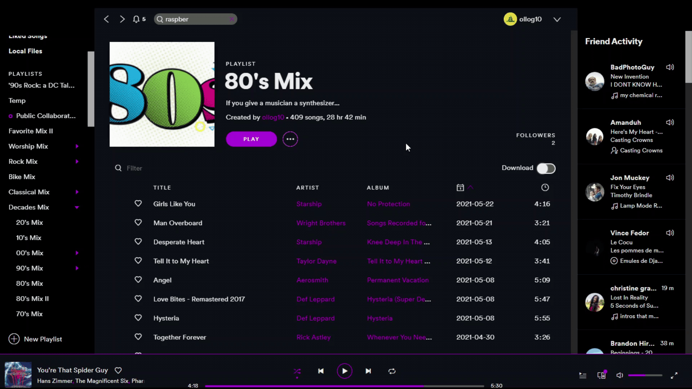

# AlbumReleaseDate
An extension developed for legacy [Spicetify](https://github.com/khanhas/spicetify-cli/) that adds specific release dates to albums/eps/singles, under the artist name.

## What it does
The extension is extremely simple. It replaces the year displayed on the album page with the exact date of release. Some albums don't have an exact release date provided by the Spotify API; in this case, the year is left as-is.
There is a configuration option to change the way the release date is formatted. Documentation is provided in the code for users that wish to modify the extension configuration.

## How to install it
Make sure you have a functioning install of legacy [Spicetify](https://github.com/khanhas/spicetify-cli/) (v1.2.1). Download the file in this repository called `AlbumReleaseDate.js` and place this file inside your `.spicetify/Extensions` folder. If this is your first time downloading an extension, you may want to reference [this](https://github.com/khanhas/spicetify-cli/wiki/Extensions) document.
Once you have placed the file in the Extensions directory, you need to open the file called `config.ini` (should be in the parent directory) and edit the `Extensions` value under `AdditionalOptions`. If you have no other extensions, set it equal to the filename (`AlbumReleaseDate.js`). If you have other extensions installed, proceed the filename with a pipe character (`|`) as mentioned in the [documentation](https://github.com/khanhas/spicetify-cli/wiki/Extensions). 

## What if it doesn't work
If you encounter any bugs or unexpected behavior, please file an issue explaining your problem and how to replicate it. Including screenshots is always helpful, and bonus points if you mention any errors appearing in the DevTools console.

## Bonus: How it works
This is for developers that want to get a bit of an insight into how the code works.
If you reference the file, you should find it to be reasonably well-commented. I did a lot of reverse-engineering by logging events in the console and trying to determine what causes what. There are very few documentations of the Spotify Desktop API out there, and the ones that exist are heavily outdated. 
I definitely recommend looking at `spicetifyWrapper.js` inside the `jsHelper` folder in the [spicetify-cli](https://github.com/khanhas/spicetify-cli/) repository. This helped me get a fundamental understanding of what was going on. Run a github search for "spicetify" and see what repos come up. Look at other people's extensions and see if you can make sense of their code. Some of the framework laid down by Khanhas' extensions were a solid help for me.

As for what's actually going on inside of my code - I set up a `MutationObserver` on the album page's `childList`, looking for added nodes. This tells me that the current page being displayed is an album page. I immediately remove the `active` class to 'prevent' the page from loading in on the user's end. After that, I scan the HTML and extract the album URI from the page, make a `CosmosAPI` call to receive the album metadata, pass the date information from the metadata into a Luxon formatter, and inject the formatted date into the HTML for the user. Finally, I re-add the `active` class to make it look like the page has just loaded in, which, although adds an extra few hundred milliseconds, prevents complaints of users seeing the album release year change 'dynamically', when they would rather have it displayed as soon as the page loads in.

## Conclusion
Thank you for using my extension.

If you would like to contribute, please feel free to create a pull request or contact me on Discord: Ollog10#2051

God bless!
